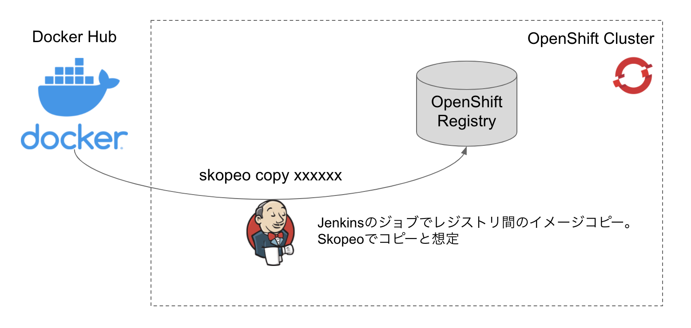

# OpenShift pipeline practice for image copy
Jenkinsのジョブを利用して外部レジストリ内のコンテナイメージをOpenShift上に取り込む例。



## How to setup
上記の作業が終わった後にJenkinsでJobの設定を行い実行

```
// Jenkinsが配置されるprojectとアプリケーションをデプロイするprojectを作成
$ oc new-project platform-operation
$ oc new-project user1-application

// カスタムのJenkinsとカスタムのJenkins agentを作成する
$ git clone https://github.com/mosuke5/openshift-custom-jenkins
$ oc apply -f example-manifest.yaml -n platform-operation
$ oc start-build custom-jenkins -n platform-operation

// カスタムのJenkinsの起動
$ oc process --param JENKINS_IMAGE_STREAM_TAG=custom-jenkins:latest --param NAMESPACE=platform-operation --param ENABLE_OAUTH=true --param MEMORY_LIMIT=4Gi --param CPU_LIMIT=2000m --param VOLUME_CAPACITY=10Gi --param DISABLE_ADMINISTRATIVE_MONITORS=true -f template.yaml | oc apply -f -

// イメージコピーのジョブで使うService Accountを作成
$ oc create sa imagecopy-job -n platform-operation
serviceaccount/imagecopy-job created

// Service Accountがアプリケーションのprojectに書き込めるように権限付与
$ oc policy add-role-to-user edit system:serviceaccount:platform-operation:imagecopy-job -n user1-application
clusterrole.rbac.authorization.k8s.io/edit added: "system:serviceaccount:platform-operation:imagecopy-job"

// Service Accountが作成されると自動でシークレットが生成
$ oc get secret | grep imagecopy
imagecopy-job-dockercfg-45899   kubernetes.io/dockercfg               1      13s
imagecopy-job-token-gwzkq       kubernetes.io/service-account-token   4      13s
imagecopy-job-token-swfg7       kubernetes.io/service-account-token   4      13s

// imagecopy-job-dockercfg-xxxxx を使ってレジストリ認証情報を作成
$ cat config.json
{
    "auth": {
        "image-registry.openshift-image-registry.svc:5000": {
            "username": "serviceaccount",
            "password": "xxxxx",
            "email": "serviceaccount@example.org",
            "auth": "xxxxx"
        }
    }
}

// secretの作成とJenkinsにSyncするためのラベル付与
$ oc create secret generic mysecretfile --from-file=filename=config.json
$ oc label secret mysecretfile credential.sync.jenkins.openshift.io=true
```
